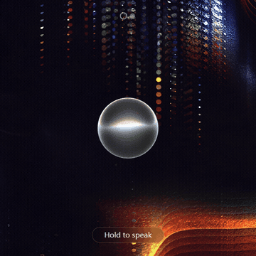
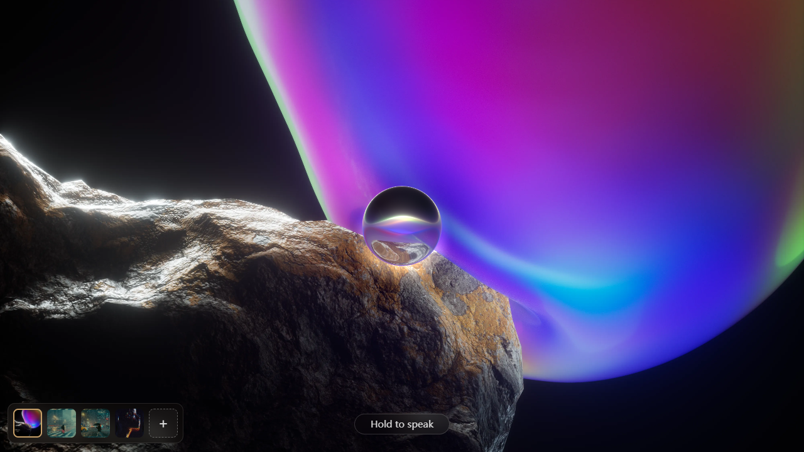
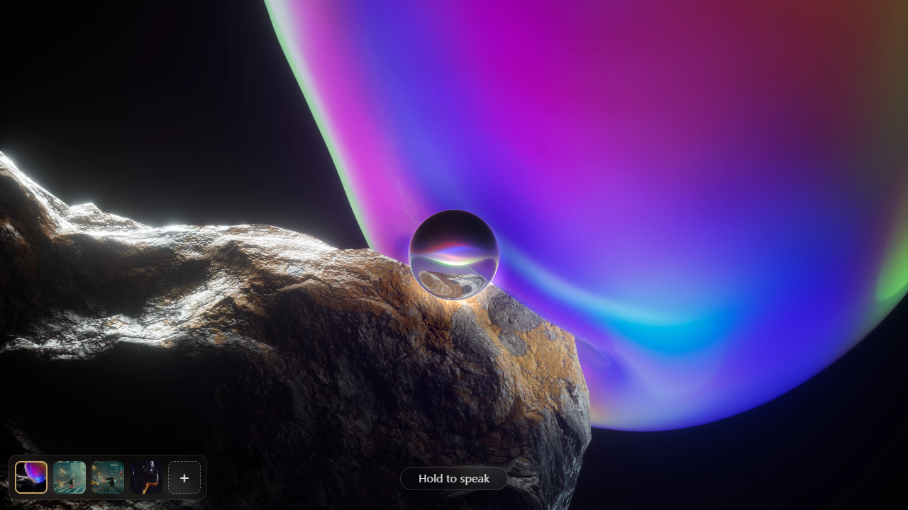
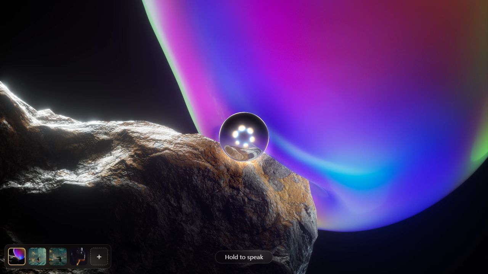
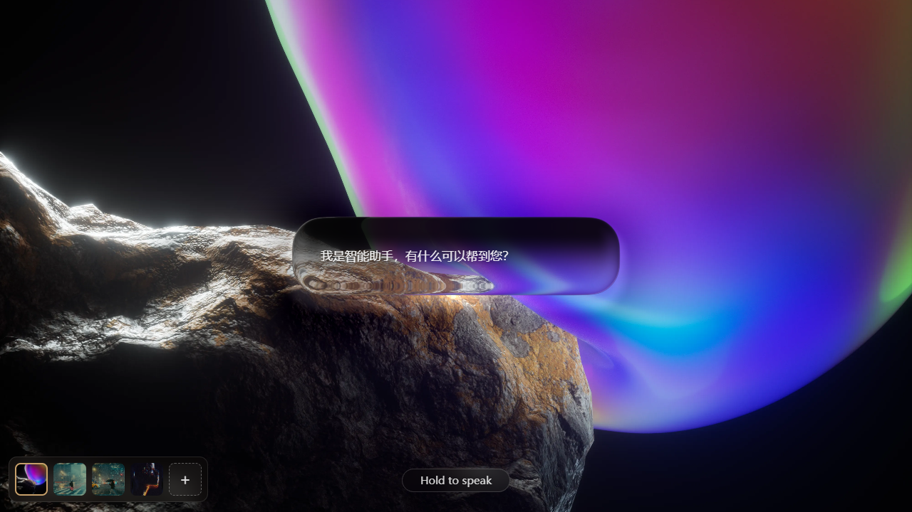
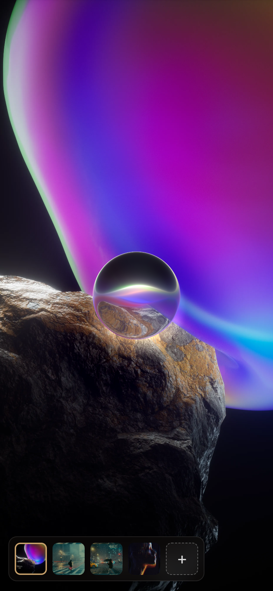

# Glass Voice Orb Study / 玻璃语音球学习项目

Non-commercial WebGL study of a liquid-glass voice orb interaction.

一个非商业 WebGL 学习项目，用来研究液态玻璃语音球交互效果。

This is an unofficial learning project. It is not affiliated with, endorsed by, or sponsored by Apple or any product team. The project is provided for personal study and non-commercial experimentation only.

这是一个非官方学习项目，与 Apple 或任何产品团队无关联、无认可、无赞助。本项目仅用于个人学习和非商业实验。

## Demo / 本地演示

Online demo:

在线演示：

```text
https://zq52xy.github.io/glass-voice-orb-study/
```

Run a local static server from the repository root:

在仓库根目录启动本地静态服务器：

```bash
python -m http.server 4173 --bind 127.0.0.1
```

Open:

```text
http://127.0.0.1:4173/
```

## Preview / 预览

The preview assets below are captured from the current GitHub Pages build with the tuning panel hidden.

以下预览素材来自当前 GitHub Pages 构建，并隐藏调参面板后捕获。

Interaction demo:

交互动图：



Desktop states and reply container:

桌面状态与回复容器：

| Idle / 待机 | Listening / 聆听 |
| --- | --- |
|  |  |

| Thinking / 思考 | Reply / 回复 |
| --- | --- |
|  |  |

Mobile:

移动端：



## Features / 功能

- WebGL2 multi-pass glass rendering.
- WebGL2 多通道玻璃渲染。
- Voice-orb idle, listening, and thinking states.
- 语音球的待机、聆听和思考状态。
- Morphing glass reply container with centered assistant copy.
- 可形变的玻璃回复容器，并居中显示助手回复。
- Optional microphone-reactive animation with demo fallback.
- 可选麦克风响应动画，并带有演示 fallback。
- Included personal background presets for the demo.
- 内置多个个人背景预设。
- In-browser tuning panel. Press `H` to hide or show it.
- 浏览器内调参面板，按 `H` 隐藏或显示。
- Tunable exterior shadow, caustic projection, vertical offsets, and light/shadow boundary softness.
- 可调节外部阴影、底部焦散、上下偏移和光影边界柔化。

## License / 许可

This repository is source-available for study and non-commercial use only. See [LICENSE](./LICENSE) and [NOTICE.md](./NOTICE.md).

本仓库源码可见，但仅允许学习和非商业使用。请查看 [LICENSE](./LICENSE) 和 [NOTICE.md](./NOTICE.md)。

Shader/source attribution is maintained in [NOTICE.md](./NOTICE.md), including the Shadertoy reference used as part of the study provenance.

Shader / 源码参考来源记录在 [NOTICE.md](./NOTICE.md)，其中包含本学习项目使用的 Shadertoy 参考来源。

The included background images are personal demo assets and are not licensed for reuse outside this repository.

内置背景图是个人演示资产，不授权在本仓库之外复用。

## Notes / 注意事项

- Do not use this project or its assets commercially.
- 请勿将本项目或其中资产用于商业用途。
- Do not imply affiliation with Apple or Siri.
- 请勿暗示本项目与 Apple 或 Siri 存在关联。
- If you replace the background image, use your own authorized asset.
- 如果替换背景图，请使用你自己有权使用的资产。
